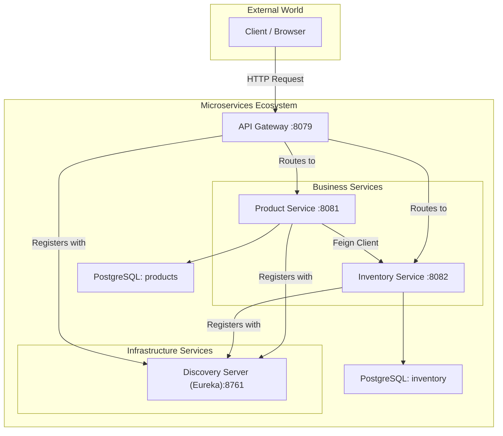

# 🛒 Spring Boot Microservices E-Commerce Project

> A practical implementation of a microservices architecture using Spring Boot, demonstrating key patterns like Service Discovery, API Gateway, and Inter-service Communication.

This project simulates a basic e-commerce backend with separate services for managing products and inventory. It is designed to be a learning boilerplate for building robust, scalable, and resilient cloud-native applications.

---

## 📚 Table of Contents

- [Features](#features)
- [Architecture](#architecture)
- [Tech Stack](#tech-stack)
- [Project Structure](#project-structure)
- [Prerequisites](#prerequisites)
- [How to Run Locally](#how-to-run-locally)
- [API Endpoints & Usage](#api-endpoints--usage)
- [Containerization (Docker)](#containerization-docker)

---

## ✨ Features

- **Microservice Architecture** – Decoupled services for different business domains (`Product`, `Inventory`)
- **Service Discovery** – Uses **Spring Cloud Netflix Eureka** for dynamic registration and discovery of services
- **Centralized Entry Point** – A single **API Gateway** (Spring Cloud Gateway) routes all external requests
- **Inter-service Communication** – Uses **Spring Cloud OpenFeign** + **Resilience4j** for resilient communication
- **Fault Tolerance** – Circuit Breaker pattern prevents cascading failures
- **Individual Databases** – Each microservice has its own PostgreSQL database

---

## 🧱 Architecture Diagram



---

## 🛠️ Tech Stack

- **Language & Frameworks**
  - Java 17
  - Spring Boot 3.3.1
  - Spring Cloud 2023.0.2
  - Spring Data JPA
- **Microservice Components**
  - Spring Cloud Gateway
  - Eureka Server (Netflix OSS)
  - OpenFeign
  - Resilience4j Circuit Breaker
- **Database**
  - PostgreSQL
- **Build Tools**
  - Apache Maven
- **Containerization**
  - Docker
  - Docker Compose

---

## 🗂️ Project Structure

```
ecommerce-microservices/
├── discovery-server/     # Eureka Server for service registration and discovery
├── api-gateway/          # Single entry point for all client requests
├── product-service/      # Manages product information
├── inventory-service/    # Manages stock levels for products
└── README.md             # This file
```

---

## ✅ Prerequisites

Ensure the following tools are installed:

- Java 17 JDK
- Apache Maven 3.8+
- PostgreSQL
- Postman or `curl`

---

## 🚀 How to Run Locally

### 1️⃣ Database Setup

Create two separate PostgreSQL databases:

```sql
CREATE DATABASE products;
CREATE DATABASE inventorys; -- Note: the plural 's'
```

### 2️⃣ Configure Datasource

Update `application.properties` for each service:

**`product-service/src/main/resources/application.properties`**
```properties
spring.datasource.url=jdbc:postgresql://localhost:5432/products
spring.datasource.username=postgres
spring.datasource.password=your_postgres_password
```

**`inventory-service/src/main/resources/application.properties`**
```properties
spring.datasource.url=jdbc:postgresql://localhost:5432/inventorys
spring.datasource.username=postgres
spring.datasource.password=your_postgres_password
```

### 3️⃣ Start Services (In Order)

Run each service in a separate terminal:

```bash
# Start Eureka Discovery Server
cd discovery-server
mvn spring-boot:run
```
> Visit: [http://localhost:8761](http://localhost:8761)

```bash
# Start Inventory Service
cd inventory-service
mvn spring-boot:run
```

```bash
# Start Product Service
cd product-service
mvn spring-boot:run
```

```bash
# Start API Gateway
cd api-gateway
mvn spring-boot:run
```

> ✅ Check Eureka dashboard — all 3 services should show status `UP`.

---

## 🔌 API Endpoints & Usage

All API requests go through the **API Gateway** on port `8079`.

---

### 📦 Inventory Service `/api/inventory`

#### ➕ Create Inventory Item
```bash
curl -X POST http://localhost:8079/api/inventory -H 'Content-Type: application/json' -d '{
  "productCode": "LAPTOP-X1",
  "quantity": 50
}'
```

#### 🔍 Get Inventory by Product Code
```bash
curl http://localhost:8079/api/inventory/product/LAPTOP-X1
```

---

### 🛍️ Product Service `/api/products`

#### ➕ Create Product
```bash
curl -X POST http://localhost:8079/api/products -H 'Content-Type: application/json' -d '{
  "name": "SuperBook Laptop Model X1",
  "price": 1499.99,
  "productCode": "LAPTOP-X1"
}'
```

#### 📄 Get All Products
```bash
curl http://localhost:8079/api/products
```

---

## 📦 Containerization (Docker)

### 🛠️ Build Docker Images

```bash
# For each service
cd product-service
mvn clean package
docker build -t your-dockerhub-username/product-service .

# Repeat for discovery-server, inventory-service, api-gateway
```

---

### 📦 Docker Compose

Create a `docker-compose.yml` in the root:

```yaml
version: '3.8'

services:
  discovery-server:
    image: your-dockerhub-username/discovery-server
    ports:
      - "8761:8761"

  inventory-service:
    image: your-dockerhub-username/inventory-service
    ports:
      - "8082:8082"
    depends_on:
      - discovery-server
    environment:
      - EUREKA_CLIENT_SERVICEURL_DEFAULTZONE=http://discovery-server:8761/eureka/
      - SPRING_DATASOURCE_URL=jdbc:postgresql://your-db-host/inventorys
      - SPRING_DATASOURCE_USERNAME=postgres
      - SPRING_DATASOURCE_PASSWORD=your_postgres_password

  product-service:
    image: your-dockerhub-username/product-service
    ports:
      - "8081:8081"
    depends_on:
      - discovery-server
    environment:
      - EUREKA_CLIENT_SERVICEURL_DEFAULTZONE=http://discovery-server:8761/eureka/
      - SPRING_DATASOURCE_URL=jdbc:postgresql://your-db-host/products
      - SPRING_DATASOURCE_USERNAME=postgres
      - SPRING_DATASOURCE_PASSWORD=your_postgres_password

  api-gateway:
    image: your-dockerhub-username/api-gateway
    ports:
      - "8079:8079"
    depends_on:
      - discovery-server
      - product-service
      - inventory-service
    environment:
      - EUREKA_CLIENT_SERVICEURL_DEFAULTZONE=http://discovery-server:8761/eureka/
```

> 💡 **Note:** Replace `your-db-host` with a database container or external DB IP. Do not use `localhost` inside Docker.

---
